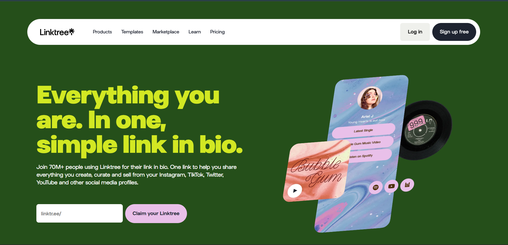

# 🌐 LinkTree Clone - Next.js & MongoDB


A simple and clean **LinkTree-style** app where users can create a public page containing multiple useful links. Built using **Next.js**, **MongoDB**, and **Tailwind CSS**.

## 🚀 Features

- 🔗 Add, update, and delete multiple links  
- 📄 Display all links on a public page  
- 📱 Fully responsive UI  
- 🌈 Styled using Tailwind CSS  
- 🗃️ MongoDB for storing link data  

## 🛠 Tech Stack

- **Frontend & Backend:** [Next.js](https://nextjs.org/)  
- **Styling:** [Tailwind CSS](https://tailwindcss.com/)  
- **Database:** [MongoDB](https://www.mongodb.com/) with Mongoose  


## 📦 Getting Started

## 1. Clone the repo
```
git clone https://github.com/mr-coder-raj/LinkTree-Clone_NextJS-MongoDB.git
```

## 2. Move into the project directory
```
cd LinkTree-Clone_NextJS-MongoDB
```

## 3. Install dependencies
```
npm install
```

## 4. Create `.env.local` and add:
```
MONGODB_URI=your_mongo_connection_string
```

## 5. Run the dev server
```
npm run dev
```


Open your browser and visit:
👉 http://localhost:3000

>Note:
>Make sure your MongoDB URI is correctly set in .env.local or the app will not load links.

## 🤝 Contributing
Contributions are welcome!
Fork the repo, make changes, and open a pull request. For major changes, open an issue to discuss your idea first.

## 📄 License
This project is licensed under the MIT License.

Made with ❤️ by @mr-coder-raj
